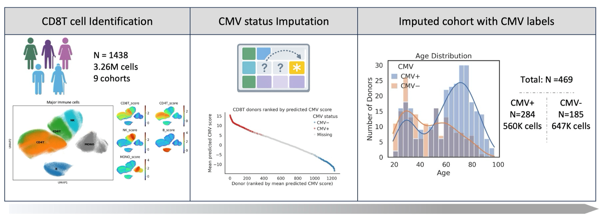
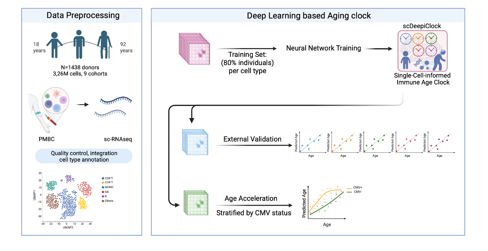

# CMV_Immune
scDeepCMV and scDeepiClock

Latent cytomegalovirus (CMV) infection is a highly prevalent lifelong exposure that reshapes human immunity and has been implicated in immunosenescence, yet its impact on immune transcriptional aging across the human lifespan remains poorly defined. Here, we integrate deep learning-based CMV status inference with single-cell immune aging clocks to quantify CMV-associated immune biological aging.
We developed scDeepCMV, a deep learning framework trained on ~980,000 immune cells, to infer latent CMV status from single-cell transcriptomes, achieving robust donor-level performance in independent validation. Applying scDeepCMV to >3 million cells from 1,438 donors revealed age-dependent, lineage-specific CMV-associated transcriptional programs, with the maximal integrated magnitude of CMV-associated transcriptional perturbation concentrated in midlife (40-60 years).We further developed scDeepiClock, a lineage-resolved immune aging clock trained on 2.61 million cells, which identified significant CMV-associated immune age acceleration, most pronounced in CD8⁺ T cells and NK cells and peaking around midlife (40-60 years), mirroring the age window of maximal CMV-associated transcriptional effects.

## scDeepCMV

## scDeepiClock

